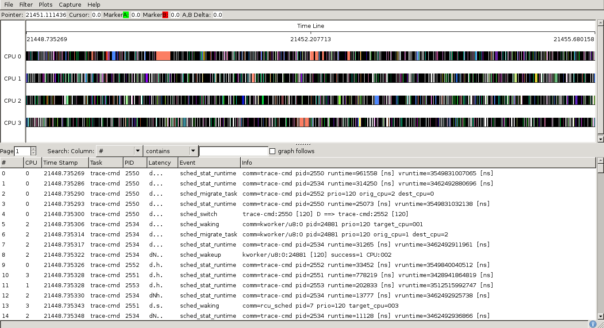

---
title:
- Linux Kernel:\ monitoring the scheduler by trace_sched* events
author:
- Marco Perronet (Università degli Studi di Torino)
institute:
- Thesis advisor:\ Enrico Bini
date:
- July 2019
theme:
- Copenhagen
colortheme:
- seahorse <!-- rose -->
header-includes:
  - \usepackage{fvextra}
  - \DefineVerbatimEnvironment{Highlighting}{Verbatim}{breaklines,commandchars=\\\{\},fontsize=\scriptsize,frame=single,framesep=2mm,breakafter=d,linenos}
---

# Objectives

1. Illustrate how scheduling works in a real operating system
- Implementation of the current scheduler (CFS, the Completely Fair Scheduler)
- Comparison with the previous schedulers

2. Write documentation for the scheduler events
- Function and event tracing
- `ftrace` usage

# GNU/Linux
<!-- Subsystems e separazione memoria -->
{ width=250px }

## Why "GNU/Linux"?

- Linux is the kernel
- GNU is the application software, running on top of the kernel

# Linux Kernel

The kernel is the core of the operating system. It is the software intended to
manage the hardware resources. Some of its roles are:

- Responding to I/O requests
- Managing memory allocation
- Deciding how CPU time is shared among the demanding processes (*scheduling*)
<!-- Scheduling e subsystems -->

<!-- The kernel needs to make the most out of hardware: its efficiency makes the difference between a fast or slow operating system. -->

# Scheduler

- Scheduling classes are an extensible hierarchy of scheduler modules
- A task from a scheduling class can be chosen to run only if there are no runnable tasks in classes higher in the hierarchy
- Each process has a scheduling policy associated

## Scheduling classes and policies

\begin{table}[t]
% \small
\centering
\begin{tabular}{|c|c|}
\hline
\textbf{Scheduling classes} & \textbf{Scheduling policies}\\
\hline
\texttt{stop\_sched\_class} &\\
\hline
\texttt{dl\_sched\_class}   & \texttt{SCHED\_DEADLINE}\\
\hline
\texttt{rt\_sched\_class}   & \texttt{SCHED\_FIFO} \\
                   		   & \texttt{SCHED\_RR}\\
\hline
\texttt{fair\_sched\_class} & \texttt{SCHED\_NORMAL}\\
                   & \texttt{SCHED\_BATCH}\\
                   & \texttt{SCHED\_IDLE}\\
\hline
\texttt{idle\_sched\_class} &\\          
\hline
\end{tabular}
\end{table}

# Tuning and extending the scheduler
<!-- Il kernel è lo stesso su server e desktop -->
<!-- Favorire server vs desktop -->
The workload on servers is different from the workload on desktops (CPU bound vs I/O bound). The scheduler must be changed accordingly:

- Implementing a new scheduling policy. Scheduling classes are made to be extensible, so scheduling policies are handled by the scheduler without the core
code assuming about them too much.
- Changing the existing scheduler's behavior with tunable values

## Source files

- `dl_sched_class` -- `kernel/sched/deadline.c`
- `rt_sched_class` -- `kernel/sched/rt.c`
- `fair_sched_class` -- `kernel/sched/fair.c`
- Core code shared by all classes -- `kernel/sched/core.c`

# Tuning and extending the scheduler

```{.c .allowframebreaks}
// Code from ./kernel/sched/fair.c
/* The idea is to set a period in which each task runs once.
 *
 * When there are too many tasks (sched_nr_latency) 
 * we have to stretch this period
 * because otherwise the slices get too small.
 */
static u64 __sched_period(unsigned long nr_running) {
	if (unlikely(nr_running > sched_nr_latency))
		return nr_running * sysctl_sched_min_granularity;
	else
		return sysctl_sched_latency;
}
```

- `sysctl_sched_min_granularity` -- The minimum time a task is allowed to run on a CPU before being preempted
- `sysctl_sched_latency` -- The default scheduler period

**What if we tweak the granularity?** <!-- Too small = too much time context switching, too big = low interactivity, better for CPU bound tasks -->

# Completely Fair Scheduler (CFS)

CFS tries to model an ideal multi-tasking CPU where each task runs for the same amount of time. Total fairness would mean that with $n$ tasks, every task receives $\frac{1}{n}$ of the processor’s time.

CFS is a Dynamic Priority scheduling policy. In order to know which task deserves to run next, every task keeps track of the total amount of time that it has spent running (*runtime*). This
value is used as priority.

## Picking the next task

Being as fair as possible with all the task means
keeping all the tasks’ runtimes as close as possible to each other.

Following this logic, the task that deserves more than anyone to be executed 
next is the one with the smallest runtime.
<!-- To also take into account the \textit{nice} values of the tasks, the runtime of each task is weighted with its \textit{nice}: this value is called *virtual runtime*. -->

# Completely Fair Scheduler (CFS)

\begin{block}{Virtual runtime}
\textit{Vruntime} is the runtime of the task, weighted based on \textit{nice}. For high priority tasks (low \textit{nice} value), vruntime is less than
the real time spent on the CPU. In this case, vruntime grows slower than real time. The opposite is true for low priority tasks (high \textit{nice} value).
\end{block}

The runqueue is implemented through a red-black tree, which is ordered with the virtual runtime.

# Completely Fair Scheduler (CFS) 

\begin{equation}
  weight = \dfrac{1024}{(1.25)^{nice}}.
  \label{eq:weight_nice}
\end{equation}

\begin{figure}[tb]
\includegraphics[width=.75\textwidth]{images/weight.png}
\end{figure}

# Completely Fair Scheduler (CFS) 
<!-- queste equazioni sono applicate uguali nel codice -->
<!-- lo scheduler period è calcolato con la funzione __sched_period() vista prima-->
Both the timeslice and the runtime must be weighted.

<!-- The timeslice is not fixed and varies for each process -->
<!-- target latency = scheduler period -->
\begin{equation} 
    assigned\_time = target\_latency \frac{task\_weight}{total\_weight}
\end{equation}
\begin{equation}
    vruntime = runtime \frac{weight\_of\_nice\_0}{task\_weight}
\end{equation}

- *Equation 2*: the task's timeslice is proportional to its weight.
- *Equation 3*: tasks with a higher priority modifier will have a low vruntime, and will be picked more often by the scheduler.

# `ftrace` (Function tracer)

`ftrace` is a debug tool embedded in the kernel. It is also useful to approach and understand the code.

`ftrace` can perform function and event tracing.

## Function tracing

Traces the path taken by kernel functions. Entry and exit point of the functions are traced, so the total duration of the function can be calculated. This allows latencies to be easily detected.

## Event tracing

Based on static tracepoints in the code, which are called just like functions. Unlike function tracing, tracepoints are static, so they cannot be toggled at runtime.
<!-- They are just like prints but more efficient -->

# Function tracing

- Thanks to code instrumentation, function tracing creates zero overhead when it's not used.

- It’s possible to filter what is being traced by dynamically activating
tracing only on functions from a single subsystem, or on one function alone.

### Code instrumentation

At compile time, extra assembly instructions are generated to help debuggers and analysis tools. `ftrace` exploits `gcc`'s code instrumentation feature, and uses *runtime injection* for dynamic toggling. 

# Function tracing

```{.txt .allowframebreaks }
 0)               |  scheduler_tick() {
 0)   0.094 us    |    _raw_spin_lock();
 0)   0.116 us    |    update_rq_clock.part.84();
 0)               |    task_tick_fair() {
 0)               |      update_curr() {
 0)   0.086 us    |        update_min_vruntime();
 0)   0.093 us    |        cpuacct_charge();
 0)   1.631 us    |      } /* update_curr */
 0)   0.074 us    |      update_cfs_shares();
 0)   0.124 us    |      hrtimer_active();
 0)   4.320 us    |    } /* task_tick_fair */
 0)               |    cpu_load_update_active() {
 0)   0.069 us    |      tick_nohz_tick_stopped();
 0)               |      cpu_load_update() {
 0)   0.088 us    |        sched_avg_update();
 0)   0.940 us    |      } /* cpu_load_update */
 0)   2.419 us    |    } /* cpu_load_update_active */
 0)   0.102 us    |    calc_global_load_tick();
 0)               |    trigger_load_balance() {
 0)   0.094 us    |      raise_softirq();
 0)   0.183 us    |      nohz_balance_exit_idle.part.85();
 0)   1.890 us    |    } /* trigger_load_balance */
 0) + 13.238 us   |  } /* scheduler_tick */
```

# Event tracing

Event tracing is performed at specific points in the code known as *tracepoints*. It’s less efficient than function tracing because it doesn’t use runtime injection.

Tracepoint functions are generated by the `TRACE_EVENT(...)` macro, which allows developers to quickly declare their own events to trace from outside the kernel.

## Why not just use `printk()` ?

* Tracepoints are more efficient: it is faster to write in `ftrace`'s ring buffer than in standard output.
* When debugging the scheduler or other high-volume areas, `printk()`'s overhead can introduce heisenbugs or even create a live lock.
* Output from tracepoints can be quickly filtered by selectively toggling them from userspace.

# Event tracing

```{.c .allowframebreaks }
static void update_curr(struct cfs_rq *cfs_rq) {
	struct sched_entity *curr = cfs_rq->curr;
	u64 now = rq_clock_task(rq_of(cfs_rq));
	u64 delta_exec = now - curr->exec_start;

	if (unlikely((s64)delta_exec <= 0))
		return;

	curr->exec_start = now; // Reset exec_start
	schedstat_set(curr->statistics.exec_max, max(delta_exec, curr->statistics.exec_max));
	curr->sum_exec_runtime += delta_exec; // Non-weighted runtime
	schedstat_add(cfs_rq->exec_clock, delta_exec);
	curr->vruntime += calc_delta_fair(delta_exec, curr); // Applies vruntime equation
	update_min_vruntime(cfs_rq);

	if (entity_is_task(curr)) {
		struct task_struct *curtask = task_of(curr);
		trace_sched_stat_runtime(curtask, delta_exec, curr->vruntime); // Tracepoint
	}
}
```

# Event tracing

```{.txt .allowframebreaks fontsize=\tiny}
# tracer: nop
#
# entries-in-buffer/entries-written: 116546/459475   #P:4
#
#                      _-----=> irqs-off
#                     / _----=> need-resched
#                    | / _---=> hardirq/softirq
#                    || / _--=> preempt-depth
#                    ||| /     delay
#   TASK-PID   CPU#  ||||    TIMESTAMP  FUNCTION
#      | |       |   ||||       |         |
  <idle>-0     [000] d...   611.283814: sched_switch: prev_comm=swapper/0 prev_pid=0 prev_prio=120 prev_state=R ==> next_comm=Xorg next_pid=1450 next_prio=120
	Xorg-1450  [000] d...   611.283921: sched_stat_runtime: comm=Xorg pid=1450 runtime=117083 [ns] vruntime=17539094302 [ns]
    Xorg-1450  [000] d...   611.283924: sched_switch: prev_comm=Xorg prev_pid=1450 prev_prio=120 prev_state=S ==> next_comm=swapper/0 next_pid=0 next_prio=120
  <idle>-0     [000] d...   611.283957: sched_switch: prev_comm=swapper/0 prev_pid=0 prev_prio=120 prev_state=R ==> next_comm=Xorg next_pid=1450 next_prio=120
```

# Interfacing with `ftrace`

\begin{figure}[tb]
\includegraphics[width=\textwidth]{images/shell_proc.png}
\caption{The \texttt{procfs} special filesystem}
\end{figure}

# Interfacing with `ftrace`

\begin{figure}[tb]
\includegraphics[width=\textwidth]{images/shell_sched.png}
\caption{Scheduler events in the \texttt{tracefs} special filesystem}
\end{figure}

- Enable scheduler events:

`echo 1 > enable`

- Enable only the `sched_stat_runtime` event:

`echo 1 > sched_stat_runtime/enable`

# KernelShark


# KernelShark



# Thank you!
